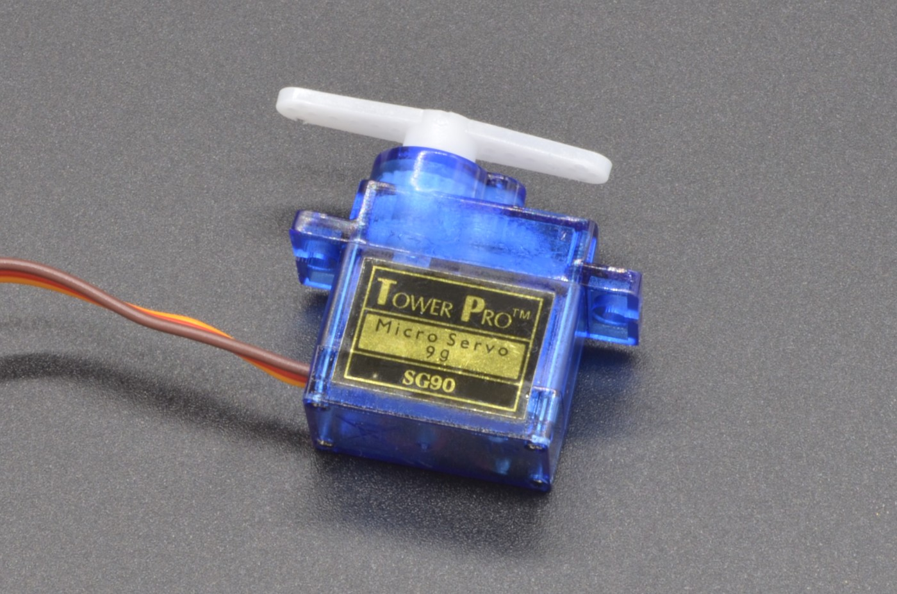
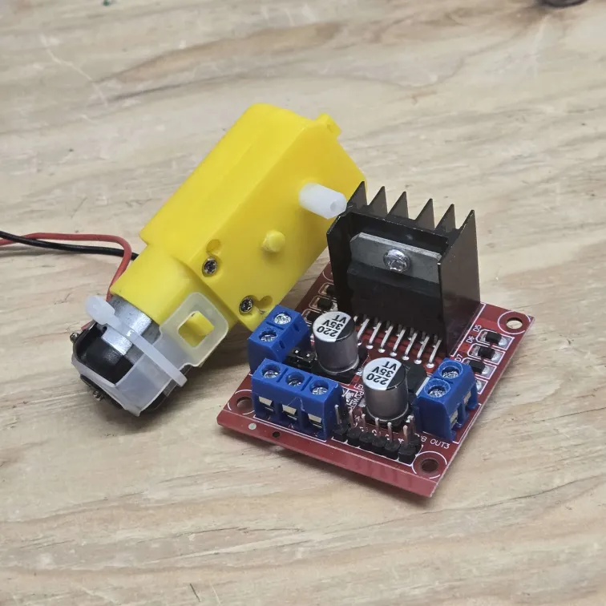
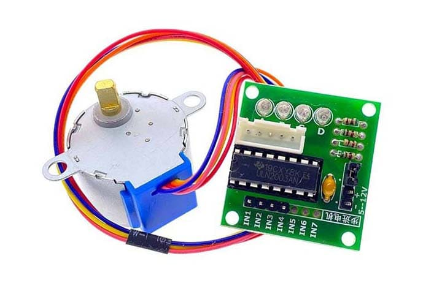

# Electronics pieces

 

## Sensors

| Picture | Name | Description |
| --- | --- | --- |
|  | Button | A push-button (also spelled pushbutton) or simply button is a simple switch mechanism to control some aspect of a machine or a process. Buttons are typically made out of hard material, usually plastic or metal. |
|  | Photoresistor | A photoresistor (or light-dependent resistor, LDR, or photo-conductive cell) is a light-controlled variable resistor. The resistance of a photoresistor decreases with increasing incident light intensity; in other words, it exhibits photoconductivity. |

## Actuators

| Picture | Name | Description | 
| --- | --- | --- |
|  | Servo motor | A servo motor is a rotary actuator or linear actuator that allows for precise control of angular or linear position, velocity and acceleration. It consists of a suitable motor coupled to a sensor for position feedback. |
|  | DC Motor & l298 | A DC motor is any of a class of rotary electrical motors that converts direct current electrical energy into mechanical energy. The most common types rely on the forces produced by magnetic fields. |
|  | Stepper motor | A stepper motor, also known as step motor or stepping motor, is a brushless DC electric motor that divides a full rotation into a number of equal steps. The motor's position can then be commanded to move and hold at one of these steps without any position sensor for feedback. |
